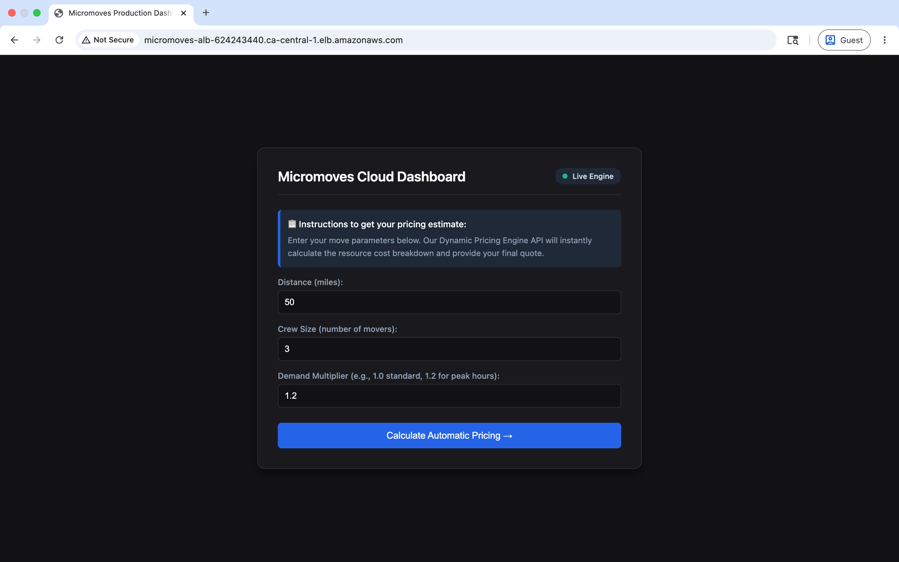

**Cloud Based Operational Efficiency Infrastructure and Dynamic Pricing Engine**

Client: Micromoves Inc. (Logistics and Moving Operations)  
Objective: Automate inquiries, process core pricing cost-matrices, and secure operational data records via a multi-tier cloud topology.  
Target Architecture: Amazon Web Services (AWS)

Project Architecture Overview
This system migrates legacy scheduling frameworks into a secure, distributed cloud pipeline:

Workload Management: Public web traffic routes through an Internet-facing Application Load Balancer (ALB) to balance operational capacity across redundant Availability Zones.

Network Isolation Tiers: Enforces strict subnet partitioning (Operations, Payments, Management, Guest/IoT) to protect distinct transactional and administrative boundaries.

Transactional Reliability: Powered by an Amazon RDS PostgreSQL environment guaranteeing data consistency across all incoming moving logistics logging parameters.

Infrastructure Processing Layers

1. Dynamic Pricing Microservice Engine (src/app_server.py)
Processes parameter variables natively on active instance web ports, computing real-time surcharges using an analytical matrix calculation.

2. Move Log Ingestion Pipeline (src/movelogger.py / src/init_db.sql)
Validates secure relational data storage hooks. Execution tracking yields verified infrastructure parameters:
SUCCESS: Injected live operational booking record! Assigned ID: [MM-RDS-1]

AWS Cloud Infrastructure Deployments

1. Dynamic Pricing Console Homepage

2. Calculated Logistics Quote Summary

3. Complete Resource Mapping Overview

4. Application Load Balancer Configuration

5. Target Group System Health Monitoring

6. High-Availability Auto Scaling Parameters

Core Technologies and Competencies
Cloud Infrastructure Platform: Amazon Web Services (VPC, RDS PostgreSQL, EC2, ALB, Auto Scaling)
Backend Systems: Python 3, Flask Web Services, Embedded CSS Interface Layouts, Relational SQL Schema Definition
